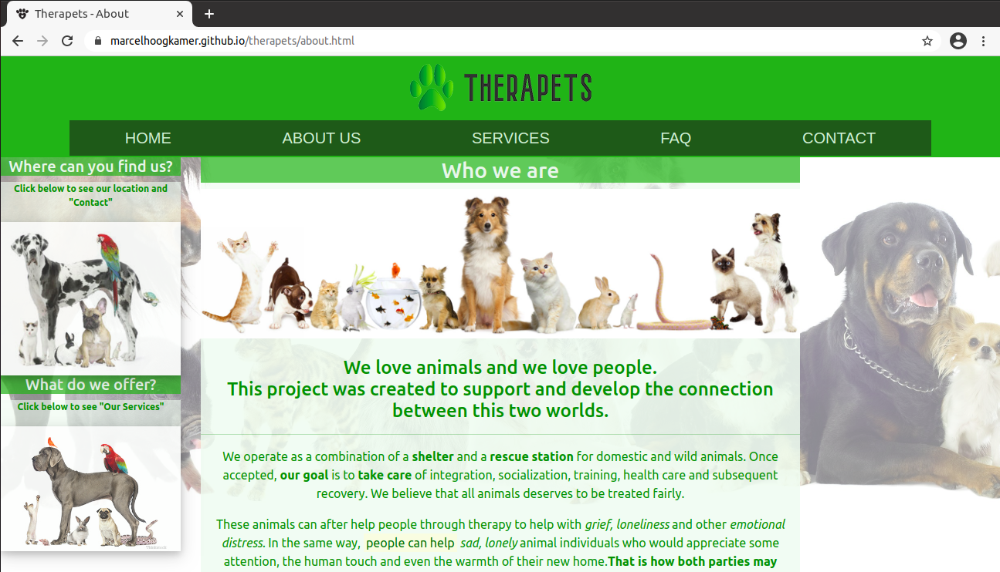
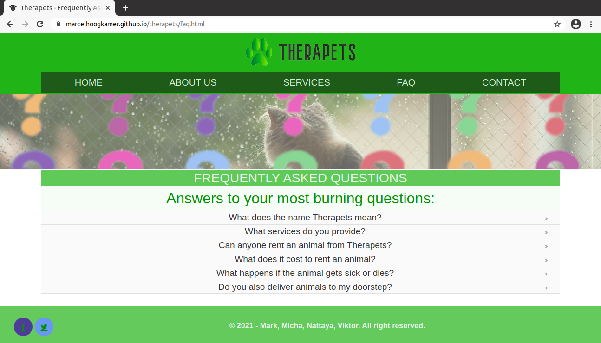

# Therapets

### A website project created by four students of BeCode as a group project.

>
[Michaela Harinova](https://github.com/mharin)  

[Marcel Hoogkamer](https://github.com/MarcelHoogkamer)  

[Nattaya Trouillard](https://github.com/Nattaya-TR)   

[Viktor Podevyn](https://github.com/viktor-podevyn)   

#### It is a consolidation challenge project to improve our CSS and HTML knowledge and group co-working.
> The goal is to create a fictive company, create the company website and deploy her via Github page.\
Github is used by BeCode as a tool for educational purposes.

### HOME page

### ABOUT page

### CONTACT page

### FAQ page

### SERVICE page

